# Syntactic Graphs

* \<programa\>

  

* \<corpo\>

  

* \<dc\>

  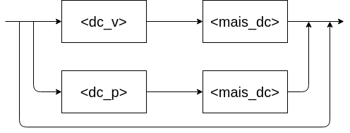

* \<mais_dc\>

  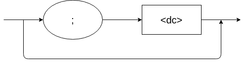

* \<dc_v\>

  

* \<tipo_var\>

  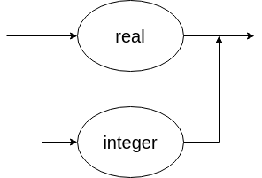

* \<variaveis\>

  

* \<mais_var\>

  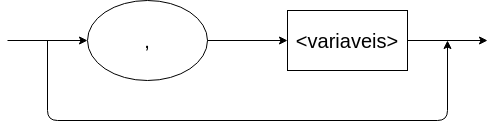

* \<dc_p\>

  

* \<parametros\>

  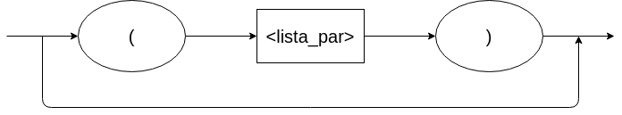

* \<lista_par\>

  

* \<mais_par\>
  

* \<corpo_p\>
  

* \<dc_loc\>
  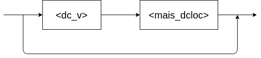

* \<mais_dcloc\>

* \<lista_arg\>
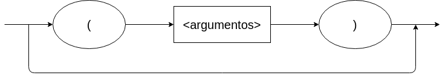

* \<argumentos\>

* \<mais_ident\>
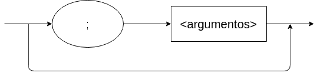

* \<pfalsa\>
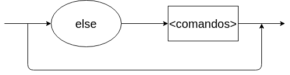

* \<comandos\>

* \<mais_comandos\>

* \<comando\>
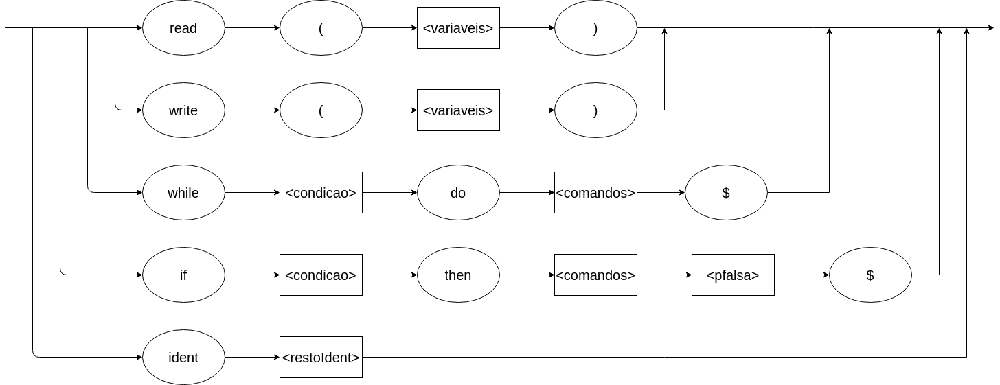

* \<restoIdent\>
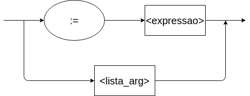

* \<condicao\>

* \<relacao\>
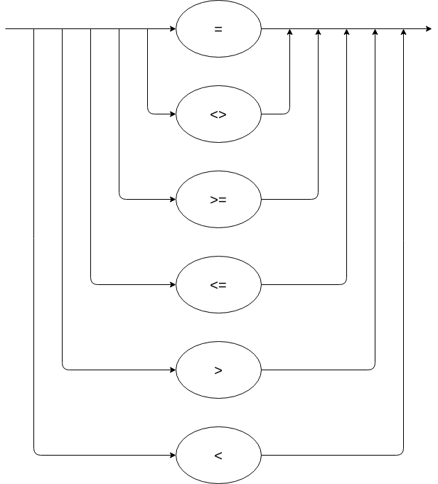

* \<expressao\>

* \<op_un\>
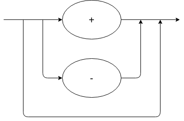

* \<outros_termos\>
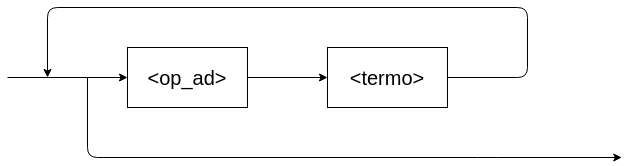

* \<op_ad\>
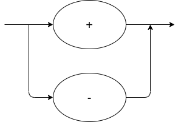

* \<termo\>

* \<mais_fatores\>
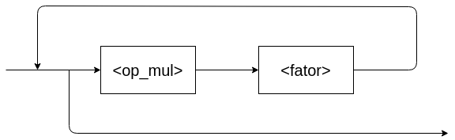

* \<op_mul\>
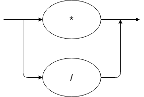

* \<fator\>
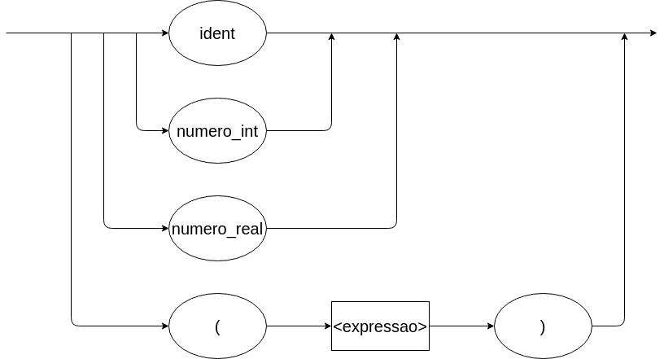