# 	Syntactic Graphs

* \<programa\>

  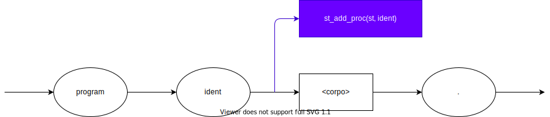

* \<corpo\>

  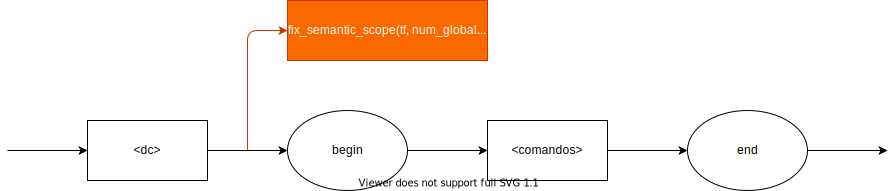

* \<dc\>

  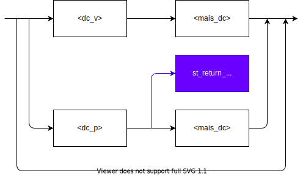
* \<dc_v\>

  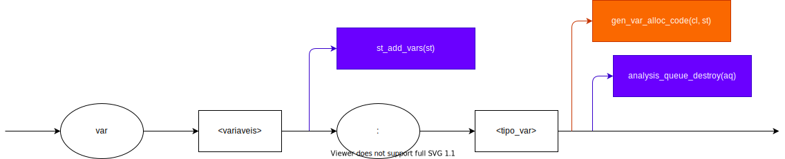
  
* \<variaveis\>

  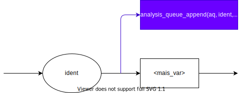

* \<mais_dc\>

  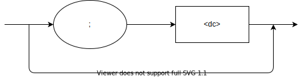

* \<tipo_var\>

  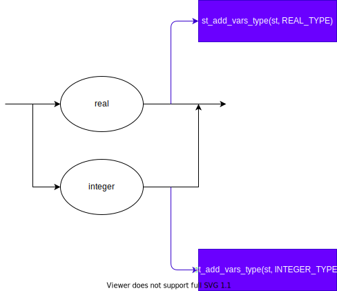

* \<mais_var\>

  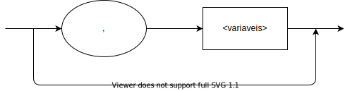

* \<dc_p\>

  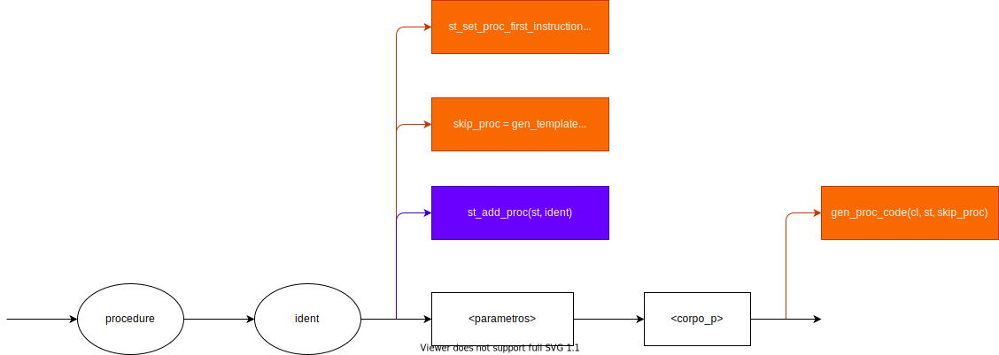

* \<parametros\>

  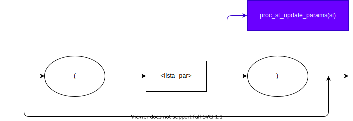

* \<lista_par\>

  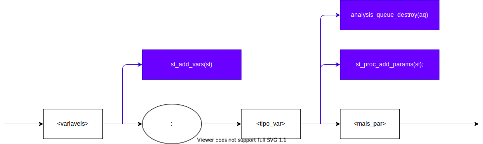

* \<mais_par\>

  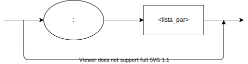

* \<corpo_p\>

  

* \<dc_loc\>

  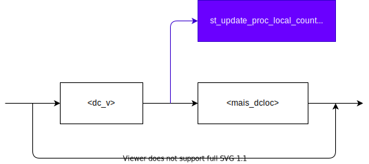

* \<mais_dcloc\>

* \<lista_arg\>

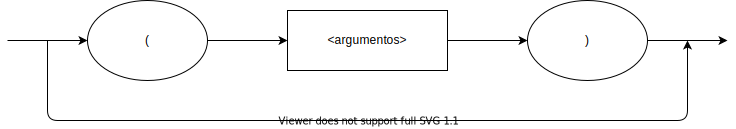

* \<argumentos\>

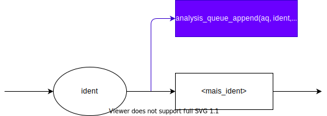

* \<mais_ident\>

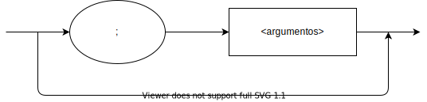

* \<pfalsa\>

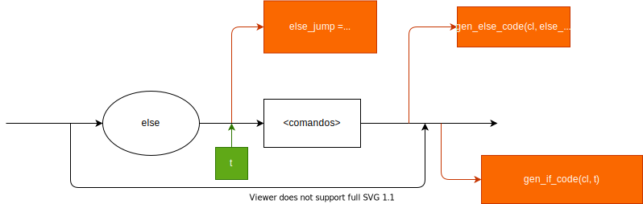

* \<comandos\>

* \<mais_comandos\>

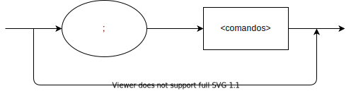

* \<comando\>

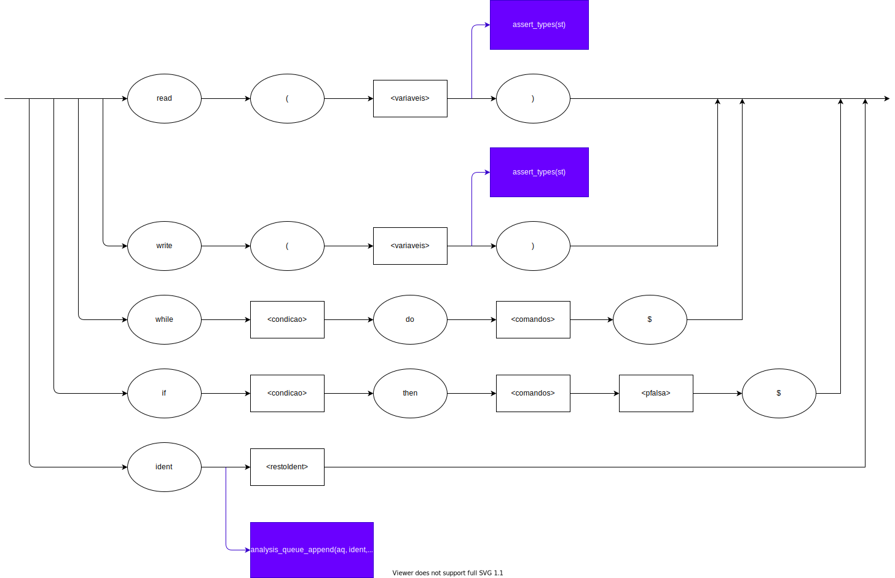

* \<restoIdent\>

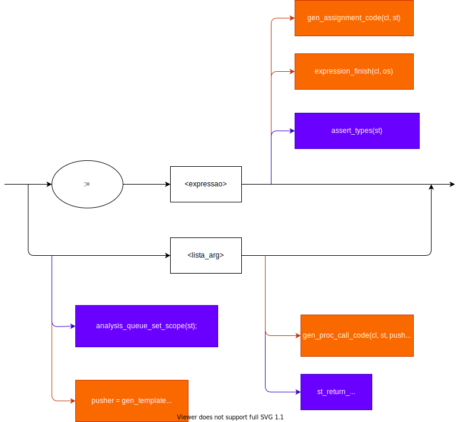

* \<condicao\>

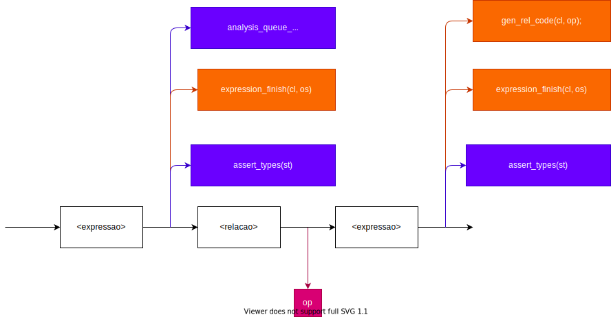

* \<relacao\>

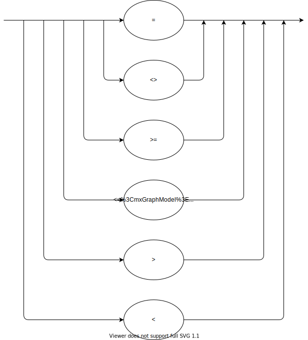

* \<expressao\>

* \<op_un\>

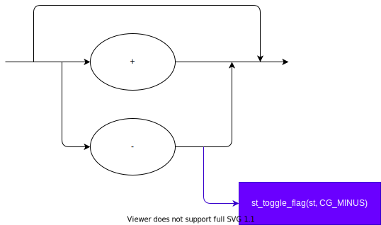

* \<outros_termos\>

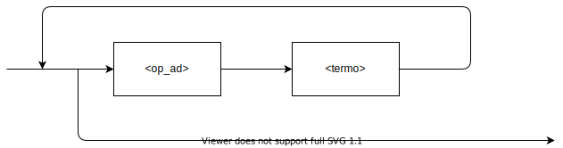

* \<op_ad\>

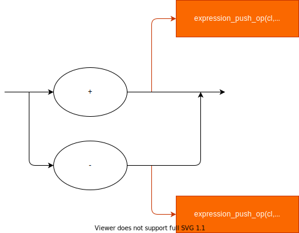

* \<termo\>

* \<mais_fatores\>

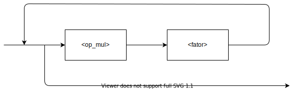

* \<op_mul\>

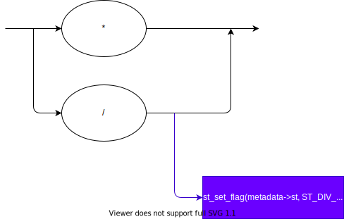

* \<fator\>

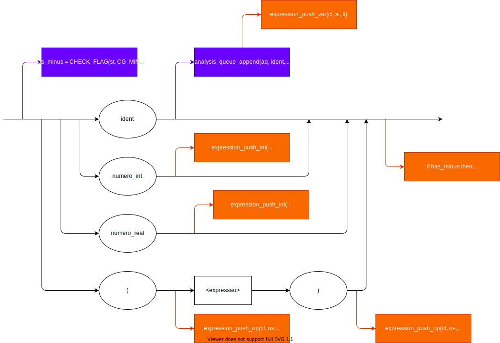
