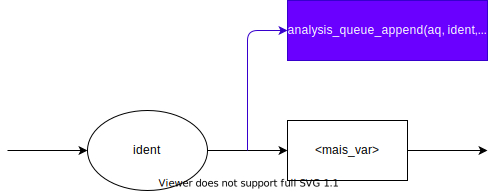
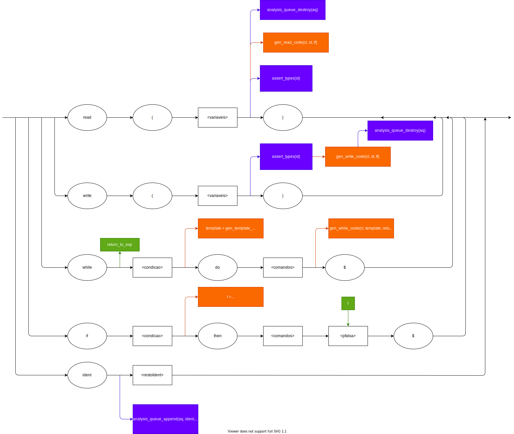
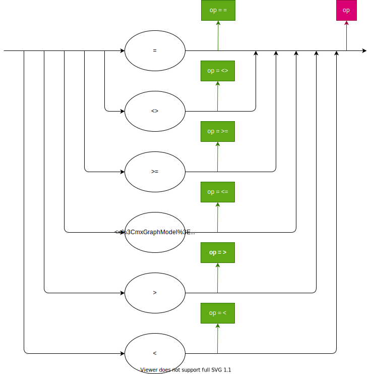
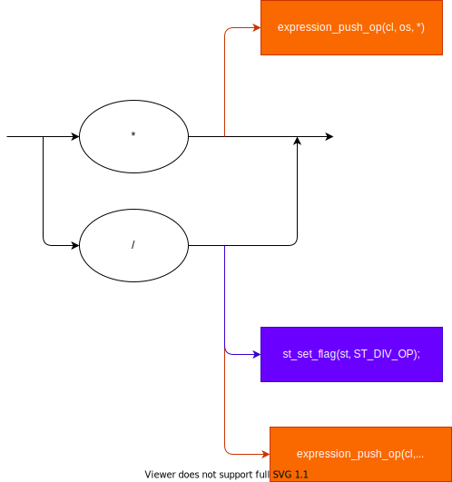

# 	Syntactic Graphs

* \<programa\>

  

* \<corpo\>

  

* \<dc\>

  
* \<dc_v\>

  
  
* \<variaveis\>

  

* \<mais_dc\>

  

* \<tipo_var\>

  

* \<mais_var\>

  

* \<dc_p\>

  

* \<parametros\>

  

* \<lista_par\>

  

* \<mais_par\>

  

* \<corpo_p\>

  

* \<dc_loc\>

  

* \<mais_dcloc\>

* \<lista_arg\>

* \<argumentos\>

* \<mais_ident\>

* \<pfalsa\>

* \<comandos\>

* \<mais_comandos\>

* \<comando\>

* \<restoIdent\>

* \<condicao\>

* \<relacao\>

* \<expressao\>

* \<op_un\>

* \<outros_termos\>

* \<op_ad\>

* \<termo\>

* \<mais_fatores\>

* \<op_mul\>

* \<fator\>

